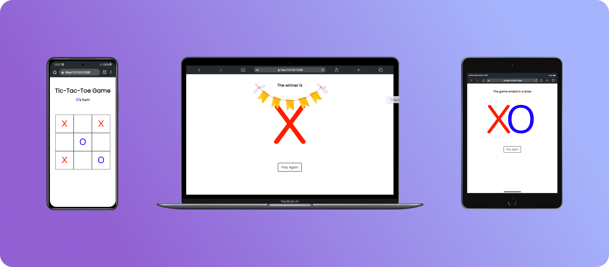

<h1 align="center"> Tic-Tac-Toe Game </h1>

Um simples jogo da velha feito em HTML, CSS e JavaScript.

  <a href="#tecnologias">Tecnologias</a>&nbsp;&nbsp;&nbsp;|&nbsp;&nbsp;&nbsp;
  <a href="#projeto">Projeto</a>&nbsp;&nbsp;&nbsp;|&nbsp;&nbsp;&nbsp;
  <a href="#licença">Licença</a>&nbsp;&nbsp;&nbsp;|&nbsp;&nbsp;&nbsp;
  <a href="#contato">Contato</a>

  

 

  

## 🚀 Tecnologias

Esse projeto foi desenvolvido com as seguintes tecnologias:

- HTML
- CSS
- JavaScript

## 💻 Projeto

A ideia desse projeto é ser divertida e interativa para os amantes de jogos simples e estratégicos, como o Jogo Da Velha.

Veja o site clicando nesse [link](https://matheusfdosan.github.io/tic-tac-toe/).

## Licença

Este projeto está sob a licença MIT. Sinta-se à vontade para contribuir, fazer fork e usar este projeto como base para seus próprios projetos!

## Contato

- Acesse também meus outros repositórios no [Github](https://github.com/matheusfdosan?tab=repositories).

- Também me siga no [Instagram](https://instagram.com/matheusfdosan).

- Crie conexão comigo no [Linkedin](https://linkedin.com/in/matheusfaus).
